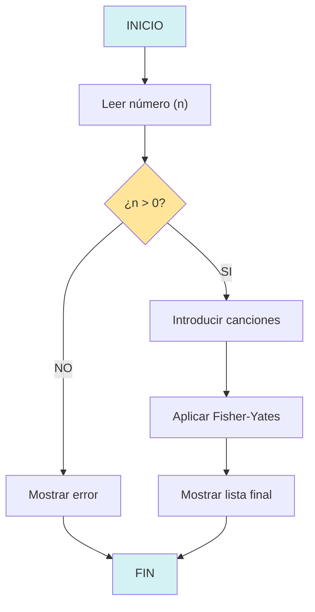

```mermaid
flowchart TD

A[INICIO] --> B["Leer número (n)"]
B --> C{¿n > 0?}
C -- NO --> D[Mostrar error]
D --> E[FIN]
C -- SI --> F[Introducir canciones]
F --> G[Aplicar Fisher-Yates]
G --> H[Mostrar lista final]
H --> E

style A fill:#d4f1f4
style E fill:#d4f1f4
style C fill:#ffe599
```
