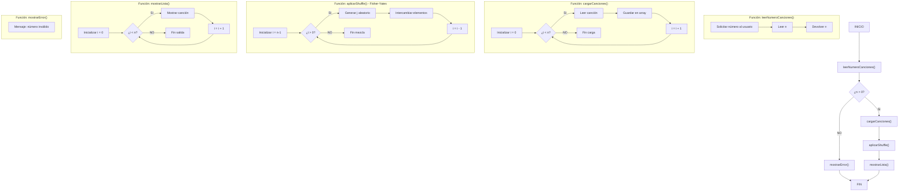

```mermaid
flowchart TD

%% MAIN
A[INICIO] --> B["leerNumeroCanciones()"]
B --> C{¿n > 0?}

C -- NO --> D["mostrarError()"]
D --> Z[FIN]

C -- SI --> E["cargarCanciones()"]
E --> F["aplicarShuffle()"]
F --> G["mostrarLista()"]
G --> Z[FIN]


%% FUNCION: leerNumeroCanciones
subgraph F1 ["Función: leerNumeroCanciones()"]
    B1[Solicitar número al usuario]
    B2[Leer n]
    B3[Devolver n]
    B1 --> B2 --> B3
end


%% FUNCION: cargarCanciones
subgraph F2 ["Función: cargarCanciones()"]
    E1[Inicializar i = 0]
    E2{¿i < n?}
    E3[Leer canción]
    E4[Guardar en array]
    E5[i = i + 1]

    E1 --> E2
    E2 -- SI --> E3 --> E4 --> E5 --> E2
    E2 -- NO --> E6[Fin carga]
end


%% FUNCION: aplicarShuffle
subgraph F3 ["Función: aplicarShuffle() - Fisher-Yates"]
    F1A[Inicializar i = n-1]
    F1B{¿i > 0?}
    F1C[Generar j aleatorio]
    F1D[Intercambiar elementos]
    F1E[i = i - 1]

    F1A --> F1B
    F1B -- SI --> F1C --> F1D --> F1E --> F1B
    F1B -- NO --> F1F[Fin mezcla]
end


%% FUNCION: mostrarLista
subgraph F4 ["Función: mostrarLista()"]
    G1[Inicializar i = 0]
    G2{¿i < n?}
    G3[Mostrar canción]
    G4[i = i + 1]

    G1 --> G2
    G2 -- SI --> G3 --> G4 --> G2
    G2 -- NO --> G5[Fin salida]
end


%% FUNCION: error
subgraph F5 ["Función: mostrarError()"]
    D1[Mensaje: número inválido]
end
```
